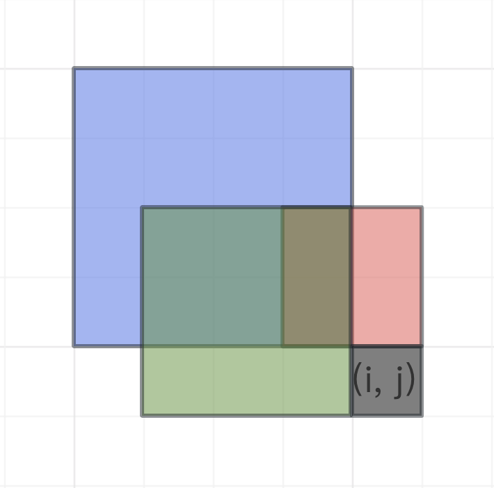

v[Toyota Programming Contest 2023#4（AtCoder Beginner Contest 311） - AtCoder](https://atcoder.jp/contests/abc311)

先暂时放上翻译，题解以后再更
比较轻松的一场，简单记录一下

## [A - First ABC](https://atcoder.jp/contests/abc311/tasks/abc311_a)

> 给你一个只含有`A`、`B`、`C`的字符串 $S$ ，每种字符会出现至少一次。求出 $S$ 包含每种字符的最短前缀，输出前缀长度。

扫一轮，记录出现次数就可以了

```cpp
#include <iostream>

using namespace std;

const int maxn = 110;
int n, cnt[3];
char s[maxn];

int main()
{
    cin >> n >> s;
    for(int i = 0; i < n; i++)
    {
        cnt[s[i] - 'A']++;
        if(cnt[0] && cnt[1] && cnt[2])
        {
            cout << i + 1 << endl;
            break;
        }
    }
    return 0;
}
```


---

## [B - Vacation Together](https://atcoder.jp/contests/abc311/tasks/abc311_b)

> 有 $N$ 个人，每人都有一个长度为 $D$ 的字符串 $S_i$ 表示他接下来 $D$ 天是否有空。若 $S_{i,j}$ 是`x`表示第 $i$ 个人的第 $j$ 天没空，`o`则表示有空。
>
> 这 $N$ 个人打算找一段连续的，且大家都有空的时间出来玩，求出最长的时间。

`o`相当于`1`，`x`相当于`0`，用`&`运算合并成一个字符串，然后滑动窗口取最长。

```cpp
#include <iostream>

using namespace std;

const int maxn = 110;
int n, d;
char now[maxn], s[maxn];

int main()
{
    cin >> n >> d;
    for(int i = 0; i < d; i++)
        now[i] = 'o';
    for(int i = 0; i < n; i++)
    {
        cin >> s;
        for(int j = 0; j < d; j++)
            if(s[j] == 'x')
                now[j] = 'x';
    }
    int ans = 0;
    for(int i = 0; i < d; i++)
    {
        if(now[i] == 'x')
            continue;
        int j = i;
        while(j+1 < d && now[j+1] == 'o')
            j++;
        ans = max(ans, j - i + 1);
        i = j+1;
    }
    cout << ans << endl;
    return 0;
}
```


---

## [C - Find it!](https://atcoder.jp/contests/abc311/tasks/abc311_c)

> 给定一个具有 $N$ 个点、$N$ 条边的有向图，每个点都有且只有一条出边。同时给定一个长度为 $N$的序列 $A$，用 $A_i$ 表示有一条边 $(i, A_i)$ 且 $i ≠ A_i$。
>
> 可以证明图中至少存在一个环，找出任意一个环，首先输出环的长度，然后按照顺序输出环中的点。

环存在其实很好证明，因为每个点都有一个出边，随便选一个点开始一直访问，一定会有一个点访问次数超过1次。

假设访问顺序为 $v_1v_2v_3...v_xv_{x+1}...v_{x+k}v_x$ ，则 $v_xv_{x+1}...v_{x+k}v_x$就是环。用`ord`数组记录访问顺序，`fir`数组记录第一次出现的下标即可在 $O(n)$ 时间完成。

```cpp
#include <iostream>
#include <cstdio>
#include <algorithm>
#include <cstring>

using namespace std;

const int maxn = 2E5 + 10;
int n, A[maxn], ord[maxn], fir[maxn];

int main()
{
    cin >> n;
    for(int i = 1; i <= n; i++)
        scanf("%d", &A[i]);
    int cur = 1, v = 1;
    while(!fir[v])
    {
        fir[v] = cur;
        ord[cur++] = v;
        v = A[v];
    }
    printf("%d\n", cur-fir[v]);
    for(int i = fir[v]; i < cur; i++)
        printf("%d ", ord[i]);
    return 0;
}
```


---

## [D - Grid Ice Floor](https://atcoder.jp/contests/abc311/tasks/abc311_d)

> 给定一个 $N \times M$ 的矩阵，`#`表示岩石，`.`表示冰块。矩阵下标从 $(1, 1)$ 开始，地图的四周一定是岩石，岩石不可通行，你的人物初始停留在 $(2, 2)$ 。人物每次移动时，从上下左右选择一个方向，一路滑行，直到碰到岩石，并在岩石前面的冰块停留，然后开始下一次移动。求出人物能经过的冰块数量（停留也算经过）。

很基础的dfs

```cpp
#include <iostream>

using namespace std;

const int maxn = 200 + 10;
int n, m;
char g[maxn][maxn];
bool vis[maxn][maxn], col[maxn][maxn];
int dr[] = {-1, 1, 0, 0};
int dc[] = {0, 0, -1, 1};

void dfs(int r, int c)
{
    vis[r][c] = 1;
    for(int i = 0; i < 4; i++)
    {
        int nr = r, nc = c;
        while(g[nr+dr[i]][nc+dc[i]] == '.')
        {
            nr += dr[i], nc += dc[i];
            col[nr][nc] = 1;
        }
        if(!vis[nr][nc])
            dfs(nr, nc);
    }
}

int main()
{
    cin >> n >> m;
    for(int i = 0; i < n; i++)
        scanf("%s", g[i]);
    col[1][1] = 1;
    dfs(1, 1);
    int ans = 0;
    for(int i = 0; i < n; i++)
        for(int j = 0; j < m; j++)
            ans += col[i][j];
    cout << ans << endl;
    return 0;
}
```


---

## [E - Defect-free Squares](https://atcoder.jp/contests/abc311/tasks/abc311_e)

> 给定一个 $H \times W$ 的矩阵，矩阵中有 $N$ 个位置是洞，用 $(r_i, c_i)$ 表示第 $i$ 个洞的位置
>
> 问：矩阵中有多少个没有洞的正方形？
>
> 数据范围：$1 ≤ H,W ≤ 3000$

预处理出前缀和，正方形的和为0相当于没有洞。然后枚举左上角，对于正方形的边长，二分一个最大值出来，正方形的边长就是以这个点为左上角的个数。$O(n^2logn)$，常数较小，我做的时候就是二分过的。

```cpp
#include <iostream>
#include <cstdio>

using namespace std;

const int maxn = 3010;
typedef long long LL;
int n, m, s[maxn][maxn], k, len[maxn][maxn];
int getsum(int r1, int c1, int r2, int c2)
{return s[r2][c2] - s[r2][c1-1] - s[r1-1][c2] + s[r1-1][c1-1];}
int check(int r, int c, int n)
{return !getsum(r, c, r+n-1, c+n-1);}

int main()
{
    cin >> n >> m >> k;
    while(k--)
    {
        int r, c;
        scanf("%d %d", &r, &c);
        s[r][c] = 1;
    }
    for(int i = 1; i <= n; i++)
        for(int j = 1; j <= m; j++)
            s[i][j] += s[i-1][j] + s[i][j-1] - s[i-1][j-1];
    int l, r;
    LL ans = 0;
    for(int i = 1; i <= n; i++)
        for(int j = 1; j <= m; j++)
        {
            if(getsum(i, j, i, j) == 1)
                continue;
            l = max(1, len[i-1][j-1]-1);
            r = min(n-i, m-j) + 1;
            while(l < r)
            {
                int x = (l + r + 1) / 2;
                if(check(i, j, x))
                    l = x;
                else
                    r = x - 1;
            }
            len[i][j] = l;
            ans += l;
        }
    cout << ans << endl;
    return 0;
}
```

这里用了`len`数组，`len[i][j]`表示以`(i,j)`为左上角的没有洞的正方形的最大边长，显然，`len[i][j]`与`len[i-1][j-1]`是有关系的，二分的时候用`len`数组可以更加精准的确定`l`的下界，优化了一点常数。

不过既然能想到`len`之间的关联，dp几乎是呼之欲出的，只需要稍作修改就可以了。

$dp[i][j]$：以 $(i, j)$ 为右下角的没有洞的正方形的最大边长。

转移也比较直观，如图，`dp[i-1][j-1], dp[i-1][j], dp[i][j-1]`叠加取最小值即可得到`dp[i][j]`

{width:"300%"}

$$
dp[i][j] = \left\{
\begin{array}{c}
&min(dp[i-1][j-1],\ dp[i-1][j],\ dp[i][j-1]) + 1& \quad	(hole[i][j] == 0) \\
&0&																								\quad	(hole[i][j] == 1)
\end{array}
\right.
$$

时间复杂度 $O(n^2)$，也不用处理前缀和了

```cpp
#include <iostream>
#include <cstdio>

using namespace std;

const int maxn = 3010;
typedef long long LL;
int n, m, k, dp[maxn][maxn];
bool hole[maxn][maxn];

int main()
{
    cin >> n >> m >> k;
    while(k--)
    {
        int r, c;
        scanf("%d %d", &r, &c);
        hole[r][c] = 1;
    }
    LL ans = 0;
    for(int i = 1; i <= n; i++)
        for(int j = 1; j <= m; j++)
        {
            dp[i][j] = hole[i][j] ? 0 : min(dp[i-1][j-1], min(dp[i][j-1], dp[i-1][j])) + 1;
            ans += dp[i][j];
        }
    cout << ans << endl;
    return 0;
}
```


---

## [F - Yet Another Grid Task](https://atcoder.jp/contests/abc311/tasks/abc311_f)

> 给定一个 $N \times M$ 的矩阵，`#`表示黑色，`.`表示白色，如果一个矩阵的所有位置满足以下条件，则称这个矩阵是美丽的：
>
> - 若 $(i, j)$ 是黑色，且 $(i+1, j)$ 存在，则 $(i+1, j)$ 也是黑色。
> - 若 $(i, j)$ 是黑色，且 $(i+1, j+1)$ 存在，则 $(i+1, j+1)$ 也是黑色。
>
> 现在，你可以将任意多个白色染成黑色，求出能将图变成美丽的染色方案数（mod `998244353`）。
>
> 数据范围：$1≤N,M≤2000$

---

## [G - One More Grid Task](https://atcoder.jp/contests/abc311/tasks/abc311_g)

> 给定一个 $N \times M$ 的矩阵 $A$ ，$A$ 的每个位置有一个正整数。用 $R$ 表示 $A$ 的子矩阵，$sum(R)$ 表示子矩阵所有数字之和，$min(R)$ 表示子矩阵中最小的数字。定义 $f(R) = sum(R) \times min(R)$，对于 $A$ 的所有子矩阵，求出最大的 $f(R)$。
>
> 数据范围：$1≤N,M,A_{i,j}≤300$

