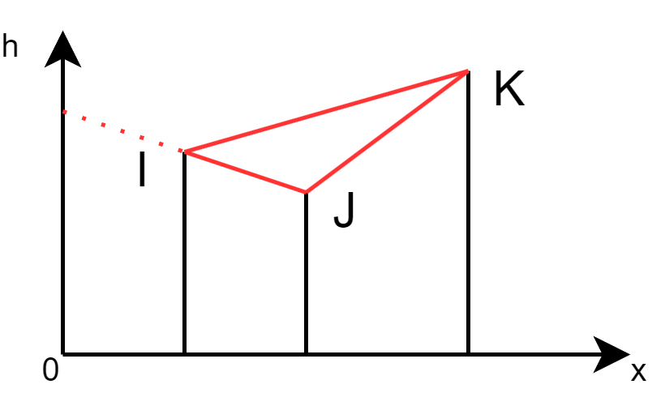
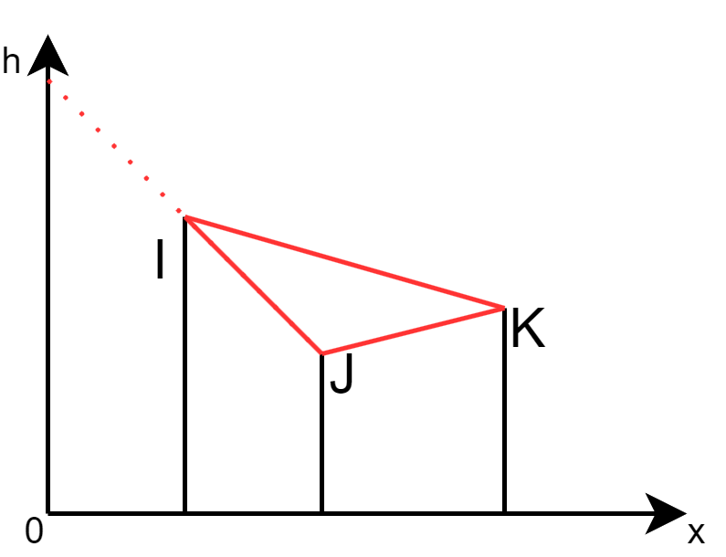

## [A - Equally](https://atcoder.jp/contests/abc385/tasks/abc385_a)

???+ Abstract "题目大意"

    给你三个整数 $A$，$B$ 和 $C$，判断能否将这三个数字分成 $2$ 组或 $3$ 组，使得每个组的数字之和相等。

??? Success "参考代码"

    === "C++"
    
        ```c++
        #include <algorithm>
        #include <iostream>
        #include <vector>
    
        using namespace std;
    
        int main()
        {
            vector<int> a(3);
            cin >> a[0] >> a[1] >> a[2];
            sort(a.begin(), a.end());
            if ((a[0] == a[1] && a[1] == a[2]) || a[0] + a[1] == a[2])
                cout << "Yes" << endl;
            else
                cout << "No" << endl;
            return 0;
        }
        ```

---

## [B - Santa Claus 1](https://atcoder.jp/contests/abc385/tasks/abc385_b)

???+ Abstract "题目大意"

    有一个 $H \times W$ 的网格，如果某个格子是 `#` 表示障碍物，`.` 表示空地，`@` 表示房子。障碍物不可通行，空地和房子可以通行。
    
    初始的时候，圣诞老人在 $(X,Y)$ 位置。给你一个字符串 $T$ 用来表示圣诞老人的行动，假设圣诞老人当前的位置是 $(x, y)$，圣诞老人会根据 $T$ 的内容执行以下移动：
    
    -   如果 $T_i$ 是 `U`，且 $(x-1, y)$ 可通行，则移动到 $(x-1, y)$
    -   如果 $T_i$ 是 `D`，且 $(x+1, y)$ 可通行，则移动到 $(x+1, y)$
    -   如果 $T_i$ 是 `L`，且 $(x, y-1)$ 可通行，则移动到 $(x, y-1)$
    -   如果 $T_i$ 是 `R`，且 $(x, y+1)$ 可通行，则移动到 $(x, y+1)$
    
    圣诞老人每经过一个房子就会送出礼物，每个房子至多送出一次礼物，问：执行完所有行动之后，圣诞老人送出了多少次礼物？

??? Success "参考代码"

    === "C++"
    
        ```c++
        #include <iostream>
        #include <set>
        #include <string>
        #include <utility>
        #include <vector>
    
        using namespace std;
    
        int main()
        {
            int h, w, x, y;
            cin >> h >> w >> x >> y;
            x--, y--;
            vector<string> g(h);
            for (auto &s : g)
                cin >> s;
            string t;
            cin >> t;
            set<pair<int, int>> vis;
    
            auto in_lim = [h, w](int r, int c) -> bool
            { return r >= 0 && r < h && c >= 0 && c < w; };
    
            for (auto ch : t)
            {
                int nx = x, ny = y;
                if (ch == 'U')
                    nx--;
                else if (ch == 'D')
                    nx++;
                else if (ch == 'L')
                    ny--;
                else
                    ny++;
                if (!in_lim(nx, ny) || g[nx][ny] == '#')
                    continue;
                x = nx;
                y = ny;
                if(g[x][y] == '@')
                    vis.insert({x, y});
            }
            cout << x + 1 << ' ' << y + 1 << ' ' << vis.size() << endl;
            return 0;
        }
        ```

---

## [C - Illuminate Buildings](https://atcoder.jp/contests/abc385/tasks/abc385_c)

???+ Abstract "题目大意"

    有 $N(1 \le N \le 3000)$ 个建筑等间距的放置在数轴上，第 $i$ 个建筑的高度是 $H_i(1 \le H_i \le 3000)$。
    
    你打算挑选一些建筑，对这些建筑进行装饰，被挑选的建筑需要满足以下所有条件：
    
    -   被挑选的建筑的高度都相同。
    -   被挑选的建筑的间距都相同。
    
    问：最多能选多少个建筑进行装饰？（注：挑选 $1$ 个建筑也满足以上条件。）

??? Note "解题思路"

    定义 $dp[i][j]$ 表示以建筑 $i$ 结尾且间距为 $j$ 的高度相等的序列的最大序列长度，因为选单个也合法，因此所有元素的初始值为 $dp[i][j]=1$，更新式为 $dp[i][j] = \max\limits_{j=1 \land H_i = H_{i-j}}^{i-1}(dp[i][j], dp[j][i-j]+1)$

??? Success "参考代码"

    === "C++"
    
        ```c++
        #include <iostream>
        #include <vector>
    
        using namespace std;
    
        int main()
        {
            int n;
            cin >> n;
            vector<int> h(n);
            vector<vector<int>> dp(n, vector<int>(n));
            int ans = 1;
            for(int i = 0; i < n; i++)
            {
                cin >> h[i];
                dp[i].assign(n, 1);
                for(int j = 0; j < i; j++)
                    if(h[i] == h[j])
                    {
                        dp[i][i-j] = dp[j][i-j] + 1;
                        ans = max(ans, dp[i][i-j]);
                    }
            }
            cout << ans << endl;
            return 0;
        }
        ```

---

## [D - Santa Claus 2](https://atcoder.jp/contests/abc385/tasks/abc385_d)

???+ Abstract "题目大意"

    有一个无限大的二维平面，在平面上有 $N(1 \le N \le 2 \times 10 ^ 5)$ 个房子，其中第 $i$ 个房子的坐标是 $(X_i, Y_i)$。初始的时候，圣诞老人在 $(S_x, S_y)$，圣诞老人会执行 $M(1 \le M \le 2 \times 10 ^ 5)$ 次行动，每一步行动由 $(D_i, C_i)$ 描述。
    
    对于第 $i$ 次行动，假设在行动前圣诞老人的位置是 $(x, y)$，则：
    
    -   如果 $D_i$ 是 `U`，表示圣诞老人从 $(x, y)$ 开始向上走 $C_i$ 格，并经过中间的房子，最终走到 $(x, y+C_i)$。
    -   如果 $D_i$ 是 `D`，表示圣诞老人从 $(x, y)$ 开始向下走 $C_i$ 格，并经过中间的房子，最终走到 $(x, y-C_i)$。
    -   如果 $D_i$ 是 `L`，表示圣诞老人从 $(x, y)$ 开始向左走 $C_i$ 格，并经过中间的房子，最终走到 $(x-C_i, y)$。
    -   如果 $D_i$ 是 `R`，表示圣诞老人从 $(x, y)$ 开始向右走 $C_i$ 格，并经过中间的房子，最终走到 $(x+C_i, y)$。
    
    圣诞老人每经过一个房子就会送出礼物，每个房子至多送出一次礼物，问：执行完所有行动之后，圣诞老人送出了多少次礼物？

??? Note "解题思路"

    用 `set` 存储每一行和每一列有哪些房子，移动的时候在 `set` 上更新就好。和 [ABC370 D题](./abc370.md) 一个做法。

??? Success "参考代码"

    === "C++"
    
        ```c++
        #include <iostream>
        #include <set>
        #include <unordered_map>
    
        using namespace std;
        using LL = long long;
    
        int main()
        {
            int n, m;
            LL x, y;
            cin >> n >> m >> x >> y;
            unordered_map<LL, set<LL>> row, col;
            while (n--)
            {
                int hx, hy;
                cin >> hx >> hy;
                col[hx].insert(hy);
                row[hy].insert(hx);
            }
            int cnt = 0;
            while (m--)
            {
                char d;
                int c;
                cin >> d >> c;
                LL nx = x, ny = y;
                if (d == 'U')
                {
                    ny += c;
                    auto it = col.find(x);
                    if (it != col.end())
                    {
                        set<LL> &xs = it->second;
                        auto set_it = xs.lower_bound(y);
                        while (set_it != xs.end())
                        {
                            int hy = *set_it;
                            if (hy > ny)
                                break;
                            cnt++;
                            row[hy].erase(x);
                            set_it = xs.erase(set_it);
                        }
                    }
                    y = ny;
                }
                else if (d == 'D')
                {
                    ny -= c;
                    auto it = col.find(x);
                    if (it != col.end())
                    {
                        set<LL> &xs = it->second;
                        auto set_it = xs.lower_bound(ny);
                        while (set_it != xs.end())
                        {
                            int hy = *set_it;
                            if (hy > y)
                                break;
                            cnt++;
                            row[hy].erase(x);
                            set_it = xs.erase(set_it);
                        }
                    }
                    y = ny;
                }
                else if (d == 'L')
                {
                    nx -= c;
                    auto it = row.find(y);
                    if (it != col.end())
                    {
                        set<LL> &xs = it->second;
                        auto set_it = xs.lower_bound(nx);
                        while (set_it != xs.end())
                        {
                            int hx = *set_it;
                            if (hx > x)
                                break;
                            cnt++;
                            col[hx].erase(y);
                            set_it = xs.erase(set_it);
                        }
                    }
                    x = nx;
                }
                else
                {
                    nx += c;
                    auto it = row.find(y);
                    if (it != col.end())
                    {
                        set<LL> &xs = it->second;
                        auto set_it = xs.lower_bound(x);
                        while (set_it != xs.end())
                        {
                            int hx = *set_it;
                            if (hx > nx)
                                break;
                            cnt++;
                            col[hx].erase(y);
                            set_it = xs.erase(set_it);
                        }
                    }
                    x = nx;
                }
            }
            cout << x << ' ' << y << ' ' << cnt << endl;
            return 0;
        }
        ```

---

## [E - Snowflake Tree](https://atcoder.jp/contests/abc385/tasks/abc385_e)

???+ Abstract "题目大意"

    一颗雪花树的定义以及生成方式如下：
    
    1.   选定两个正整数 $x$ 和 $y$。
    
    2.   放置一个节点（下图红色的节点）。
    
    3.   放置 $x$ 个节点（下图蓝色的节点），并将这 $x$ 个点各自与第 2 步放置的节点连上一条无向边。
    4.   对于第 3 步放置的每一个节点，放置 $y$ 个与其连接的节点（下图中绿色的节点）。
    
    下图是 $x = 4, y=2$ 的雪花图：
    
    
    
    给你一棵包含 $N(3 \le N \le 3 \times 10 ^ 5)$ 个节点的树 $T$，你需要删除树中的任意的点（也可以一个都不删）以及这些点关联的边。问：最少要删除多少个点，才能使的剩下的图是一颗雪花树？

??? Note "解题思路"

    显然是要枚举雪花树红色的点，假设有一个节点 $u$，$u$ 的孩子有为 $v_1, v_2, ..., v_k$，这些孩子对应的度数为 $d_{v_1}, d_{v_2}, ..., d_{v_k}$，将这些度数排个序，然后枚举可能的 $y$，如果 $y$ 很大，则度数小于 $y$ 的孩子就必须都删掉，度数大于 $y$ 的点可以只删掉多出来的部分。跑一遍 dfs 枚举就好，不过要注意以下要把孩子的度数都减掉 $1$，因为 $u$ 也有 $1$ 的度数在里面。这样时间复杂度是 $O(n\log n)$

??? Success "参考代码"

    === "C++"
    
        ```c++
        #include <algorithm>
        #include <iostream>
        #include <vector>
    
        using namespace std;
    
        int main()
        {
            int n;
            cin >> n;
            vector<vector<int>> edge(n + 1);
            vector<int> deg(n + 1);
            for (int i = 0; i < n - 1; i++)
            {
                int u, v;
                cin >> u >> v;
                deg[u]++;
                deg[v]++;
                edge[u].push_back(v);
                edge[v].push_back(u);
            }
            int ans = 0;
    
            auto dfs = [&edge, &deg, &ans](auto &self, int u, int f) -> void
            {
                vector<int> d = {};
                for (auto v : edge[u])
                {
                    if (v != f)
                        self(self, v, u);
                    d.push_back(deg[v] - 1);
                }
                sort(d.begin(), d.end());
                int len = d.size();
                for (int i = 0; i < len; i++)
                    ans = max(ans, 1 + len - i + (len - i) * d[i]);
            };
    
            dfs(dfs, 1, 0);
            cout << n - ans << endl;
            return 0;
        }
        ```

---

## [F - Visible Buildings](https://atcoder.jp/contests/abc385/tasks/abc385_f)

???+ Abstract "题目大意"

    有 $N(1 \le N \le 2 \times 10 ^ 5)$ 在一条数轴上，其中第 $i$ 个建筑的横坐标是 $X_i(1 \le X_1 < X_2 < \cdots < X_N \le 10 ^ 9)$，高度是 $H_i(1 \le H_i \le 10 ^ 9)$。某个点的位置可以用横坐标 $x$ 和纵坐标 $h$ 来描述。对于点 $P(x, h)$ 和点 $Q(x', h')$，如果连线 $PQ$ 没有与任何建筑相交，则点 $P$ 能看到点 $Q$。你打算站在 $x=0$ 的某个高度位置 $h(h > 0)$，问：最高能站在哪个位置，才看不到所有的建筑？如果无论如何都无法避免看到所有建筑，输出 `-1`

??? Note "解题思路"

    因为不能看到所有的建筑，所以至少存在一个建筑 $j$ 被建筑 $i(i < j)$ 所阻挡，这可以两两枚算出最大的高度，但是时间复杂度达到 $O(n^2)$。还需要推理一些东西，我们考虑最靠后的三个建筑 $i$，$j$  和 $k$ 的相对高度，固定建筑 $k$ 的高度，变换建筑 $i$ 和 $j$ 的相对高度：
    
    1.   假设 $H_j < H_i < H_k$，如下图所示，最大的高度是 $IJ$ 连线（因为 $IJ$ 斜率是负数）
    
    2.   假设 $H_i < H_k$，且 $H_j$ 高于 $IK$ 连线，如下图所示，此时 $IK$ 连线被挡住，那么答案是 $JK$ 连线
    
    3.   假设 $H_i < H_k < H_j$，如下图所示，那么答案是 $JK$ 连线（因为 $JK$ 斜率是负数）
    
    4.   假设 $H_j < H_k < H_i$，如下图所示，那么答案是 $IJ$ 连线
    
    5.   假设 $H_k < H_i$，且 $H_j$ 高于 $IK$ 连线，如下图所示，那么答案是 $JK$ 连线
    
    6.   假设 $H_k < H_i < H_j$，如下图所示，那么答案是 $JK$ 连线（因为 $JK$ 斜率是负数） 
    
    
    以上可知，答案一定是 $IJ$ 连线或 $JK$ 连线，而不会有 $IK$ 连线，所以答案一定是在相邻的两个建筑的连线之间取得。
    
    根据直线的两点式我们有 $\frac{h-h_1}{x-x_1} = \frac{h_2-h_1}{x_2-x_1}$，代入 $x=0$ 可得 $h = -x_1 \times \frac{h_2-h_1}{x_2-x_1} + h_1$。但是如果直接用这个式子算的话会 WA 两个点，注意到输出的时候精度要求是 $10^{-9}$，为了减少精度损失，必须化成 $h = \frac{x_2h_1 - x_1h_2}{x_2-x_1}$，约分之后再转成 `double`

??? Success "参考代码"

    === "C++"
    
        ```c++
        #include <iomanip>
        #include <iostream>
        #include <numeric>
    
        using namespace std;
        using LL = long long;
    
        int main()
        {
            int n;
            cin >> n;
            double ans = -1;
    
            auto cal = [](LL x1, LL h1, LL x2, LL h2) -> double
            {
                LL down = x2 - x1;
                LL up = x2 * h1 - x1 * h2;
                if (up < 0)
                    return -1;
                LL g = gcd(down, up);
                down /= g;
                up /= g;
                return up / (double)down;
            };
    
            LL x1, h1;
            cin >> x1 >> h1;
            while (--n)
            {
                LL x2, h2;
                cin >> x2 >> h2;
                double h = cal(x1, h1, x2, h2);
                ans = max(ans, h);
                h1 = h2;
                x1 = x2;
            }
            cout << setprecision(10) << ans << endl;
            return 0;
        }
        ```

---

