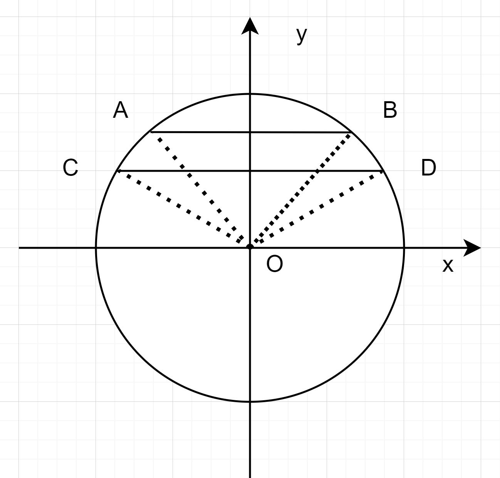
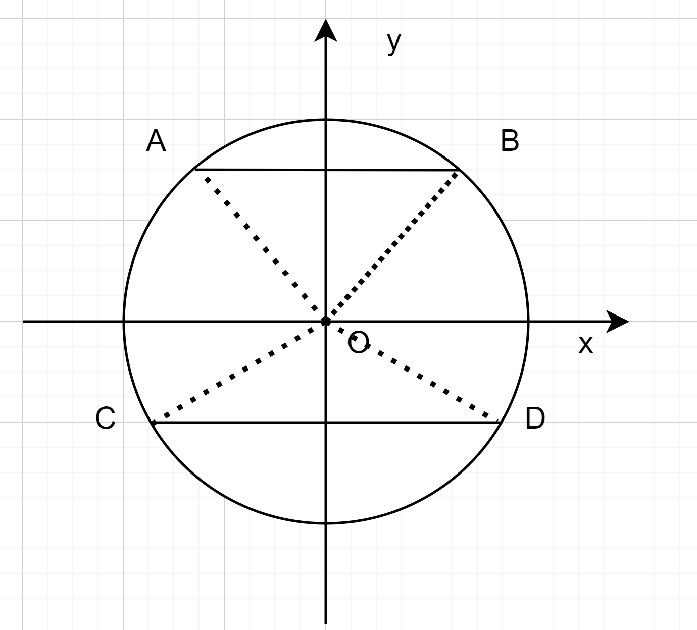

## [A - CBC](https://atcoder.jp/contests/abc402/tasks/abc402_a)

???+ Abstract "题目大意"

给你一个字符串 $S$，去掉其中所有的小写字母，输出剩下的大写字符。

??? Success "参考代码"

    === "C++"
    
        ```c++
        #include <cctype>
        #include <iostream>
        #include <string>

        using namespace std;

        int main()
        {
            string s;
            cin >> s;
            for(auto ch : s)
                if(isupper(ch))
                    cout << ch;
            return 0;
        }
        ```

---

## [B - Restaurant Queue](https://atcoder.jp/contests/abc402/tasks/abc402_b)

???+ Abstract "题目大意"

维护一个整数队列，有两种操作：
- `1 x`：将整数 $x$ 入队；
- `2`：输出队头元素，然后将其出队。

??? Success "参考代码"

    === "C++"
    
        ```c++
        #include <iostream>
        #include <queue>

        using namespace std;

        int main()
        {
            int q;
            cin >> q;
            queue<int> que;
            while(q--)
            {
                int op;
                cin >> op;
                if(op == 1)
                {
                    int x;
                    cin >> x;
                    que.push(x);
                }
                else
                {
                    int x = que.front();
                    que.pop();
                    cout << x << endl;
                }
            }
            return 0;
        }
        ```

---

## [C - Dislike Foods](https://atcoder.jp/contests/abc402/tasks/abc402_c)

???+ Abstract "题目大意"

餐厅有 $N(1 \le N \le 3 \times 10 ^ 5)$ 种食材, 编号为 $1$ 到 $N$。同时，餐厅提供 $M(1 \le M \le 3 \times 10 ^ 5)$ 道菜品。编号为 $1$ 到 $M$，其中第 $i$ 道菜品使用了 $K_i(1 \le K_i \le N)$ 种食材，具体为食材 $A_{i,1}, A_{i,2}, \ldots, A_{i,K_i}$。保证 $\sum K_i \le 3 \times 10 ^ 5$

Snuke 目前讨厌所有 $N$ 种食材。如果一道菜品使用了至少一种 Snuke 讨厌的食材，他就不能吃这道菜；反之，如果一道菜品没有使用任何他讨厌的食材，他就可以吃这道菜。

Snuke 计划用 $N$ 天时间来克服对食材的厌恶。在第 $i$ 天，他会克服对食材 $B_i$ 的厌恶，从此不再讨厌该食材。

对于每个 $i=1, 2, ..., N$，回答以下问题：

在第 $i$ 天 Snuke 克服了对食材 $B_i$ 的厌恶后，他能够吃的菜品数量。

??? Note "解题思路"

每一道菜只有最后一个食材被克服了之后才能吃。因此可以针对 $B_i$ 搞一个顺序。再遍历每一道菜，找出最后一个被克服的食材即可。

??? Success "参考代码"

    === "C++"
    
        ```c++
        #include <iostream>
        #include <unordered_map>
        #include <vector>

        using namespace std;

        int main()
        {
            int n, m;
            cin >> n >> m;
            vector<vector<int>> a(m);
            for (auto &v : a)
            {
                int k;
                cin >> k;
                v.reserve(k);
                while (k--)
                {
                    int x;
                    cin >> x;
                    v.push_back(x);
                }
            }
            unordered_map<int, int> ord;
            for(int i = 0; i < n; i++)
            {
                int x;
                cin >> x;
                ord[x] = i;
            }
            vector<int> day(m);
            for(int i = 0; i < m; i++)
                for(auto x : a[i])
                    day[i] = max(day[i], ord[x]);
            unordered_map<int, int> cnt;
            for(auto d : day)
                cnt[d]++;
            int now = 0;
            for(int d = 0; d < n; d++)
            {
                auto it = cnt.find(d);
                if(it != cnt.end())
                    now += it->second;
                cout << now << '\n';
            }
            return 0;
        }
        ```

---

## [D - Line Crossing](https://atcoder.jp/contests/abc402/tasks/abc402_d)

???+ Abstract "题目大意"

在圆周上等间距地排列着 $N(1 \le N \le 10 ^ 6)$ 个点，按顺时针方向依次编号为 $1, 2, ..., N$。

有 $M(1 \le M \le 3 \times 10 ^ 5)$ 条互不相同的直线，其中第 $i$ 条直线通过两个不同的点：点 $A_i$ 和点 $B_i$。

计算满足以下两个条件的整数对 $(i,j)$ 的个数：
- $1 \le i < j \le M$；
- 第 $i$ 条直线与第 $j$ 条直线相交

??? Note "解题思路"

判断直接相交非常困难，考虑正难则反，两条直线要么相交，要么平行。所以首先算出 $N(N-1)/2$，再减去平行的直线数目。而圆周上的平行直线，有一个性质：

首先假设直线 AB 平行于直线 CD，有两种情况：
1. 直线 AB 和直线 CD 的两个端点都在同一侧，如下图

不妨设 $\theta_D$ 表示 $\angle ODx$ 的大小，其他点以此类推，这里显然有 $\theta_A + \theta_B = \theta_C + \theta_D = \pi$。

2. 直线 AB 和直线 CD 的两个端点在不同侧，如下图

显然有 $\theta_A + \theta_B = \pi$ 且 $\theta_C + \theta_D = 3\pi$。

于是可以总结，圆周上两直线如果平行，充要条件是 $\theta_A + \theta_B \equiv \theta_C + \theta_D \bmod 2\pi$ （要么相等，要么相差 $2\pi$）

又因为这是一个等间距的圆周，不妨假设点的编号由 $0$ 开始，那么第 $A$ 个点的角度为 $\frac{2\pi A}{N}$，因此 $\theta_A + \theta_B = \frac{2\pi (A + B)}{N}$。这样的话，如果相等就是 $A + B = C + D$，如果相差 $2\pi$ 就是 $A + B \equiv C + D  \bmod N$。

所以可以通过 $A + B \equiv C + D  \bmod N$ 判断两条直线是否平行，这就很简单了，相当于 $A + B \bmod N$ 就是一个直线的斜率，只需要用哈希表存储每个斜率出现的次数即可。

??? Success "参考代码"

    === "C++"
    
        ```c++
        #include <iostream>
        #include <unordered_map>

        using namespace std;
        using LL = long long;

        int main()
        {
            LL n, m;
            cin >> n >> m;
            LL ans = m * (m - 1) / 2;
            unordered_map<int, int> cnt;
            while(m--)
            {
                int x, y;
                cin >> x >> y;
                x--, y--;
                int s = (x + y) % n;
                ans -= cnt[s];
                cnt[s]++;
            }
            cout << ans << endl;
            return 0;
        }
        ```

---

## [E - Payment Required](https://atcoder.jp/contests/abc402/tasks/abc402_e)

???+ Abstract "题目大意"

你正在参加一场比赛，共有 $N(1 \le N \le 8)$ 道题目。第 $i$ 道题目的分值为 $S_i$ 分，每次提交需要支付 $C_i$ 元。

当你提交第 $i$ 道题目时，有 $P_i$ % 的概率能正确解答该题。每次提交能否正确解答与之前的提交结果相互独立。

你有 $X$ 元。所有提交所花费的总金额不能超过 $X$ 元。

问：在采取最优提交策略的情况下，最终获得的总分的期望值最大值是多少？

注意：
- 你可以根据之前的提交结果决定下一次提交哪道题目。
- 同一道题目即使多次正确解答，得分也不会重复计算。

??? Note "解题思路"

定义 $dp[i][s]$ 表示还剩下 $i$ 元，且解题状态为 $s$ 的最大期望分数。转移也很简单，枚举每一道题，根据过或者没过求出一个期望值，最后取最优情况转移就好。

??? Success "参考代码"

    === "C++"
    
        ```c++
        #include <iomanip>
        #include <ios>
        #include <iostream>
        #include <vector>

        using namespace std;

        int main()
        {
            int n, x;
            cin >> n >> x;
            int len = 1 << n;
            vector<int> s(n), c(n);
            vector<double> p(n);
            for (int i = 0; i < n; i++)
            {
                cin >> s[i] >> c[i] >> p[i];
                p[i] /= 100;
            }
            vector<vector<double>> dp(x + 1, vector<double>(len));
            for (int i = 1; i <= x; i++)
                for (int st = 0; st < len; st++)
                    for (int j = 0; j < n; j++)
                    {
                        if (i < c[j] || st >> j & 1)
                            continue;
                        int ns = st | 1 << j;
                        double val = p[j] * (s[j] + dp[i - c[j]][ns]) + (1 - p[j]) * dp[i - c[j]][st];
                        dp[i][st] = max(dp[i][st], val);
                    }
            cout << fixed << setprecision(7) << dp[x][0] << endl;
            return 0;
        }
        ```

---

## [F - Path to Integer](https://atcoder.jp/contests/abc402/tasks/abc402_f)

???+ Abstract "题目大意"

有一个 $N \times N(1 \le N \le 20)$ 的网格。每个格子上都写有 `1` 到 `9` 的数字。

初始时，有一枚棋子位于 $(1,1)$。同时，设 $S$ 为空字符串，接下来进行 $2N−1$ 次操作：

1. 将当前棋子所在格子的数字字符追加到 $S$ 的末尾。
2. 将棋子向右或向下移动一格（第 $2N−1$ 次操作时不移动）。

$2N−1$ 次操作后，棋子将位于格子 $(N,N)$，且 $S$ 的长度为 $2N−1$。

将最终得到的字符串 $S$ 视为整数，其值对 $M(2 \le M \le 10 ^ 9)$ 取模的结果即为得分。请计算可以获得的最高得分。

??? Note "解题思路"

显然格子中每个位置在字符串 $S$ 的位置都是固定的，例如 $(1, 1)$，一定是字符串的第 $1$ 位，权重就是 $10^{2N-2} \times A_{1, 1}$，以此类推。

但是答案要求的是最后再取模的结果。如果 dfs 所有的路径的话，时间复杂度是 $O(2^{2N})$，显然不行。不过如果能砍成 $O(N^2)$ 的话就可以了。这启发我们用折半枚举。可以 dfs 两次，一次是从 $(1, 1)$ 到对角线，同时存储所有可能路径的模值，再 dfs 一次从对角线到 $(N, N)$。然后将两次 dfs 的结果合并即可。

下面考虑如何合并，在一次 dfs 中，每个对角线点至多有 $2^N$ 种路径，也就是至多有 $2^N$ 个模值，设两次 dfs 的模值集合为 $A$ 和 $B$，先对 $A$ 和 $B$ 排序，然后固定 $A$ 中的某个值 $x$，显然可以轻易的在 $B$ 中二分，或者双指针，找到一个最大的 $y$，使得 $x + y < M$，或者最大的 $y$ 使得 $x + y \ge M$，后者直接找到 $B$ 中最大的元素就可以了。

时间复杂度是 $O(2^N)$。

??? Success "参考代码"

    === "C++"
    
        ```c++
        #include <algorithm>
        #include <iostream>
        #include <vector>

        using namespace std;
        using LL = long long;

        int main()
        {
            int n;
            LL m;
            cin >> n >> m;
            vector<LL> p(2 * n);
            p[0] = 1;
            for (int i = 1; i < 2 * n; i++)
                p[i] = p[i - 1] * 10 % m;
            vector<vector<LL>> a(n, vector<LL>(n));
            for (int i = 0; i < n; i++)
                for (int j = 0; j < n; j++)
                {
                    cin >> a[i][j];
                    a[i][j] = a[i][j] * p[2 * n - 2 - i - j] % m;
                }
            int len = 1 << n;
            vector<vector<LL>> x(n), y(n);
            for (int i = 0; i < n; i++)
            {
                x[i].reserve(len);
                y[i].reserve(len);
            }

            auto dfs1 = [n, m, &a, &x](auto &self, int i, int j, LL sum) -> void
            {
                sum = (sum + a[i][j]) % m;

                if (i + j == n - 1)
                {
                    x[i].push_back(sum);
                    return;
                }

                self(self, i + 1, j, sum);
                self(self, i, j + 1, sum);
            };

            auto dfs2 = [n, m, &a](auto &self, int i, int j, LL sum, vector<LL> &y) -> void
            {
                if (i == n - 1 && j == n - 1)
                {
                    y.push_back(sum);
                    return;
                }

                if (i + 1 < n)
                    self(self, i + 1, j, (sum + a[i + 1][j]) % m, y);
                if (j + 1 < n)
                    self(self, i, j + 1, (sum + a[i][j + 1]) % m, y);
            };

            dfs1(dfs1, 0, 0, 0);
            LL ans = 0;
            for (int i = 0; i < n; i++)
            {
                dfs2(dfs2, i, n - 1 - i, 0, y[i]);
                sort(y[i].begin(), y[i].end());
                y[i].erase(unique(y[i].begin(), y[i].end()), y[i].end());
                for (auto xx : x[i])
                {
                    auto it = lower_bound(y[i].begin(), y[i].end(), m - xx);
                    if (it == y[i].begin())
                        it = y[i].end();
                    it--;
                    LL yy = *it;
                    ans = max(ans, (xx + yy) % m);
                }
            }
            cout << ans << endl;
            return 0;
        }
        ```

---
