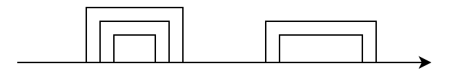

## [A - G1](https://atcoder.jp/contests/abc410/tasks/abc410_a)

???+ Abstract "题目大意"

给你 $N$ 个数字 $A = (A_1, A_2, ..., A_N)$，问：有多少个数字小于等于 $K$？

??? Success "参考代码"

    === "C++"
    
        ```c++
        #include <iostream>
        #include <vector>

        using namespace std;

        int main()
        {
            int n;
            cin >> n;
            vector<int> a(n);
            for(int i = 0; i < n; i++)
                cin >> a[i];
            int k;
            cin >> k;
            int ans = 0;
            for(auto x : a)
                ans += k <= x;
            cout << ans << endl;
            return 0;
        }
        ```
---

## [B - Reverse Proxy](https://atcoder.jp/contests/abc410/tasks/abc410_b)

???+ Abstract "题目大意"

有 $N(1 \le N \le 100)$ 个空箱子，接下来会按顺序送来 $Q(1 \le Q \le 100)$ 个球，每个球上写着一个数字 $X_i$，如果：
- $X_i \ge 1$，你需要把第 $i$ 个球放到第 $X_i$ 个箱子。
- 否则，把球放入装有球最少的箱子中编号最小的箱子里。

找出每个球被放入了哪个箱子。

??? Note "解题思路"

数据范围大的话正解是权值线段树。数据范围小的话可以用简单的模拟。

??? Success "参考代码"

    === "C++"
    
        ```c++
        #include <iostream>
        #include <vector>

        using namespace std;

        int main()
        {
            int n, q;
            cin >> n >> q;
            vector<int> b(n + 1);
            while (q--)
            {
                int x;
                cin >> x;
                if (x == 0)
                {
                    int id = 1;
                    for (int i = 2; i <= n; i++)
                        if (b[i] < b[id])
                            id = i;
                    b[id]++;
                    cout << id << ' ';
                }
                else
                {
                    b[x]++;
                    cout << x << ' ';
                }
            }
            return 0;
        }
        ```
---

## [C - Rotatable Array](https://atcoder.jp/contests/abc410/tasks/abc410_c)

???+ Abstract "题目大意"

给你一个长度为 $N(1 \le N \le 10^{6})$ 的数列 $A$，初始时 $A_i = i$。
有 $Q(1 \le Q \le 3 \times 10^{5})$ 操作：

- `1 p x`：将 $A_p$ 的值改为 $x$。
- `2 p`：输出 $A_p$ 的值。
- `3 k`：将 $A$ 循环左移 $k$ 位。

??? Note "解题思路"

对于操作 3 不需要真正执行移动，只需要记录一下目前移动了多少位即可。

??? Success "参考代码"

    === "C++"
    
        ```c++
        #include <iostream>
        #include <vector>

        using namespace std;

        int main()
        {
            int n, q;
            cin >> n >> q;
            int now = 0;
            vector<int> a(n);
            for (int i = 0; i < n; i++)
                a[i] = i + 1;

            auto get_pos = [n](int p, int now) -> int
            { return (p + now) % n; };

            while (q--)
            {
                int op;
                cin >> op;
                if (op == 1)
                {
                    int p, x;
                    cin >> p >> x;
                    p--;
                    p = get_pos(p, now);
                    a[p] = x;
                }
                else if (op == 2)
                {
                    int p;
                    cin >> p;
                    p--;
                    p = get_pos(p, now);
                    cout << a[p] << '\n';
                }
                else
                {
                    int k;
                    cin >> k;
                    now = (now + k) % n;
                }
            }
            return 0;
        }
        ```
---

## [D - XOR Shortest Walk](https://atcoder.jp/contests/abc410/tasks/abc410_d)

???+ Abstract "题目大意"

给你一个 $N(1 \le N \le 1000)$ 个点 $M(1 \le M \le 1000)$ 条边的有向图，每条边有一个权值 $W_i(0 \le W_i < 2^{10})$ 

求所有从 $1$ 到 $N$ 的路径中，可以重复经过同一个点和同一条边，路径上所有边权值的异或和的最小值。

??? Note "解题思路"

搜索题，把当前路径的异或和加在状态里就好，定义 $vis[u][s]$ 表示能否以 $s$ 的异或和到达 $u$，剩下的就是搜索了。

??? Success "参考代码"

    === "C++"
    
        ```c++
        #include <iostream>
        #include <limits>
        #include <unordered_set>
        #include <utility>
        #include <vector>

        using namespace std;
        const int INF = numeric_limits<int>::max();

        int main()
        {
            int n, m;
            cin >> n >> m;
            vector<vector<pair<int, int>>> edge(n + 1);
            while (m--)
            {
                int u, v, w;
                cin >> u >> v >> w;
                edge[u].push_back({v, w});
            }
            vector<unordered_set<int>> vis(n + 1);
            int ans = INF;

            auto dfs = [n, &ans, &edge, &vis](auto &&self, int u, int d) -> void
            {
                vis[u].insert(d);

                if (u == n)
                    ans = min(ans, d);

                for (auto [v, w] : edge[u])
                {
                    int nd = d ^ w;
                    if (vis[v].contains(nd))
                        continue;
                    self(self, v, nd);
                }
            };

            dfs(dfs, 1, 0);

            if (ans == INF)
                ans = -1;
            cout << ans << endl;
            return 0;
        }
        ```
---

## [E - Battles in a Row](https://atcoder.jp/contests/abc410/tasks/abc410_e)

???+ Abstract "题目大意"

你正在挑战 $N(1 \le N \le 3000)$ 只怪兽，初始时，你有 $H(1 \le H \le 3000)$ 点体力和 $M(1 \le M \le 3000)$ 点魔力。

对于第 $i$ 只怪兽，可以消耗 $A_i(1 \le A_i \le 3000)$ 点体力或者 $B_i(1 \le B_i \le 3000)$ 点魔力消灭。在任何时刻，你的体力或者魔力都不能为负数。

如果你面对某只怪兽时无法消灭这只怪兽，或者你消灭了所有怪兽，游戏结束。问：最多能击败多少只怪兽？

??? Note "解题思路"

背包题，定义 $dp[i][j]$ 表示消灭前 $i$ 只怪兽，且剩余 $j$ 点体力的所有方案中，最多能剩下多少点魔力。转移的时候，考虑第 $i$ 只怪兽是用体力消灭还是用魔力消灭：
- 使用体力消灭，则 $dp[i][j] = dp[i-1][j+A_i]$，前提是 $j + A_i \le H$
- 使用魔力消灭，则 $dp[i][j] = dp[i-1][j] - B_i$，前提是 $dp[i-1][j] \ge B_i$

两者取最大值就好，初始值就是 $dp[0][H] = M$，其余值为 $-1$（$-1$ 表示不可达的状态）。实现的时候还可以空间优化。

??? Success "参考代码"

    === "C++"
    
        ```c++
        #include <iostream>
        #include <vector>

        using namespace std;

        int main()
        {
            int n, h, m;
            cin >> n >> h >> m;
            vector<int> dp(h + 1, -1);
            dp[h] = m;
            int ans = -1;
            for (int i = 0; i < n; i++)
            {
                int a, b;
                cin >> a >> b;
                if (ans == -1)
                {
                    bool ok = false;
                    for (int j = 0; j <= h; j++)
                    {
                        int x = j + a <= h && dp[j + a] >= 0 ? dp[j + a] : -1;
                        int y = dp[j] >= b ? dp[j] - b : -1;
                        dp[j] = max(x, y);
                        ok |= dp[j] >= 0;
                    }
                    if (!ok)
                        ans = i;
                }
            }
            if (ans == -1)
                ans = n;
            cout << ans << endl;
            return 0;
        }
        ```
---

## [F - Balanced Rectangles ](https://atcoder.jp/contests/abc410/tasks/abc410_f)

???+ Abstract "题目大意"

给你一个 $H \times W(1 \le HW \le 3 \times 10^{5})$ 的网格 $S$，$S$ 仅由 `#` 和 `.` 组成。

求有多少 $S$ 的子矩形区域，其中 `#` 和 `.` 的个数相等。

??? Note "解题思路"

首先把 `#` 和 `.` 视为 $1$ 和 $-1$，问题就等价于求有多少个子矩形的数字和为 $0$。

固定上下边界（这一步需要 $O(H^2)$ 的时间复杂度），然后求出每一列的数字和，假设是 $a_1, a_2, ...a_W$，接下来就是求有多少个子数组的和为 $0$，这个问题可以用哈希表在 $O(W)$ 的时间内解决。所以总的时间复杂度是 $O(H^2W)$，显然 $H$ 是瓶颈，所以如果 $H \ge W$，就把矩阵旋转一下，所以时间复杂度其实是 $O(\min(H,W) HW)$，这里 $HW \le 3 \times 10^{5}$，而 $\sqrt{HW} \le 600$，所以估算一下计算量大概是 $600 \times 3 \times 10^{5} \le 2 \times 10^8$，是能过的。

??? Success "参考代码"

    === "C++"
    
        ```c++
        #include <algorithm>
        #include <ios>
        #include <iostream>
        #include <string>
        #include <vector>

        using namespace std;
        using LL = long long;

        void solve()
        {
            int h, w;
            cin >> h >> w;
            vector<vector<char>> g(min(h, w), vector<char>(max(h, w)));
            for (int i = 0; i < h; i++)
            {
                string s;
                cin >> s;
                for (int j = 0; j < w; j++)
                    if (h < w)
                        g[i][j] = s[j];
                    else
                        g[j][i] = s[j];
            }
            if (h > w)
                swap(h, w);
            int len = h * w;
            vector<int> cnt(2 * len + 1);

            auto pos = [len](int i) -> int
            { return i + len; };

            LL ans = 0;
            for (int x = 0; x < h; x++)
            {
                vector<int> c(w);
                for (int y = x; y < h; y++)
                {
                    cnt[pos(0)] = 1;
                    int sum = 0;
                    for (int j = 0; j < w; j++)
                    {
                        g[y][j] == '#' ? c[j]++ : c[j]--;
                        sum += c[j];
                        int k = cnt[pos(sum)]++;
                        ans += k;
                    }
                    sum = 0;
                    for (int j = 0; j < w; j++)
                    {
                        sum += c[j];
                        cnt[pos(sum)]--;
                    }
                }
            }
            cout << ans << '\n';
        }

        int main()
        {
            ios::sync_with_stdio(false);
            cin.tie(nullptr);
            int t;
            cin >> t;

            while (t--)
                solve();
            return 0;
        }
        ```
---

## [G - Longest Chord Chain](https://atcoder.jp/contests/abc410/tasks/abc410_g)

???+ Abstract "题目大意"

在一个圆上排列着 $2N$ 个点，从点 $1$ 到点 $2N$ 顺时针排列。

给你 $N$ 条弦，第 $i$ 条弦连接着 $A_i$ 和 $B_i$。保证 $A_1, A_2, ..., A_N, B_1, B_2, ..., B_N$ 中没有相同的点。

你需要执行如下操作：
- 选择一个弦的集合保留，删除不在此集合中的所有弦，集合需要满足其中的任意两条弦不存在交点。
- 没有额外限制地在圆上添加一条弦。

求上面两个操作被依次执行后，剩余的所有弦之间最多有多少个交点。

??? Note "解题思路"

先把环视为直线，那么问题等价于如下图

其实等价于找出最大的两个这样的不相交区间集合，然后加一条弦连接两个集合。这里左边集合有 $3$ 条弦，右边集合有 $2$ 条弦，那么最多可以形成 $3 + 2 = 5$ 个交点。

首先考虑如何找到单个最大的不相交区间集合。可以把所有弦按右端点排序，然后求出最长上升子序列就可以。

但是这样只能求出单个的，而答案其实是最大的两个集合，这里参考了 [这个题解](https://atcoder.jp/contests/abc410/editorial/13304) 的做法。做法是，首先环（线段）扩展成 $4N$，然后对于每一条弦 $[A_i, B_i]$（这里假设 $A_i < B_i$），再加一条 $[B_i, A_i + 2N]$ 的弦（我们称这些弦为“扩展弦”），然后求出最长上升子序列，就能得到答案。

下面简单证明一下，首先不难发现，$[A_i, B_i]$ 不会被 $[B_i, A_i + 2N]$ 包含，所以每一条弦 $[A_i, B_i]$ 至多只会被计数一次。

然后需要证明一个结论，如果有两条弦 $[A_i, B_i]$ 以及 $A_j, B_j$，满足 $A_i < B_i < A_j < B_j$，则一定有 $B_i < A_j < B_j \le A_i + 2N$，这其实也很显然。这个结论通俗的意思就是说，两条弦如果互不相交，那么对于第一条弦 $[A_i, B_i]$ 对应的 $[B_i, A_i + 2N]$，一定可以包含第二条弦 $[A_j, B_j]$。

进一步的，如果有两个不相交的弦集合，前一个集合的“扩展弦”组成的集合一定包含了后一个集合。因此利用相同的规则，仍然求出最长上升子序列，就能得到答案。

??? Success "参考代码"

    === "C++"
    
        ```c++
        #include <algorithm>
        #include <iostream>
        #include <utility>
        #include <vector>

        using namespace std;

        int main()
        {
            int n;
            cin >> n;
            vector<pair<int, int>> intervals;
            intervals.reserve(2 * n);
            for (int i = 0; i < n; i++)
            {
                int a, b;
                cin >> a >> b;
                if (a > b)
                    swap(a, b);
                intervals.emplace_back(a, b);
                intervals.emplace_back(b, a + 2 * n);
            }
            sort(intervals.begin(), intervals.end(), [](auto &x, auto &y) -> bool
                { return x.second > y.second; });

            vector<int> st;
            for (auto [l, _] : intervals)
            {
                if (auto it = lower_bound(st.begin(), st.end(), l); it != st.end())
                    *it = l;
                else
                    st.push_back(l);
            }
            cout << st.size() << endl;
            return 0;
        }
        ```
---

