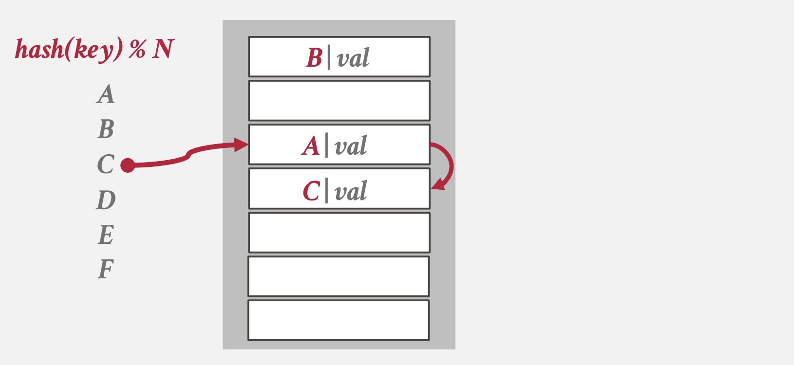
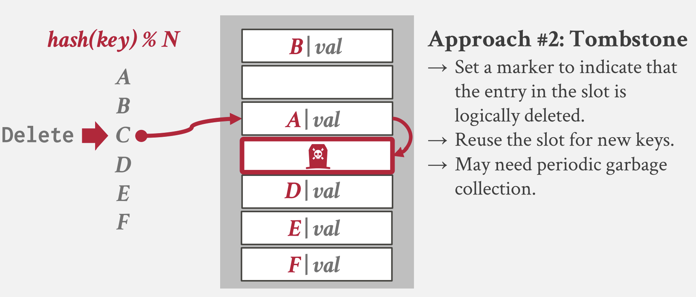
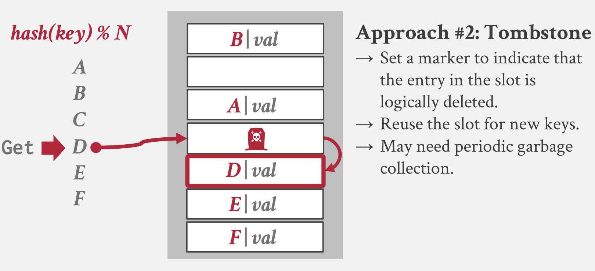
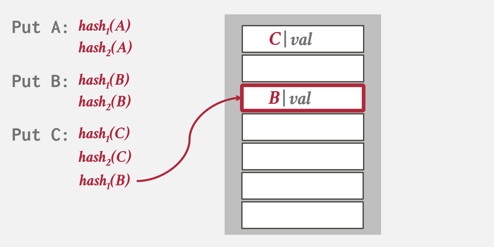
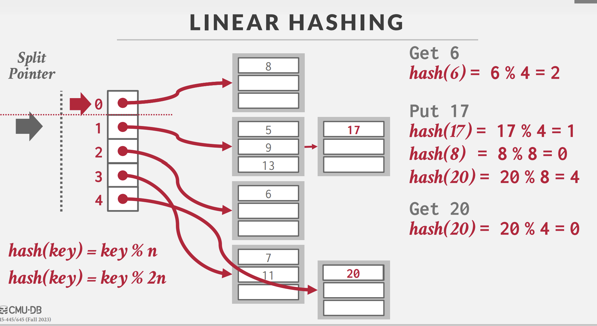
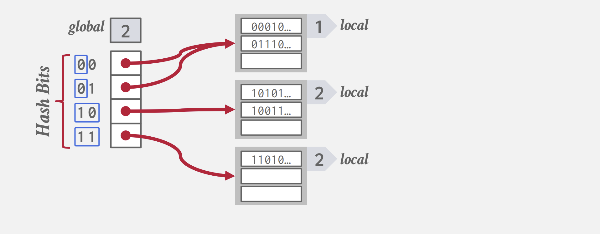
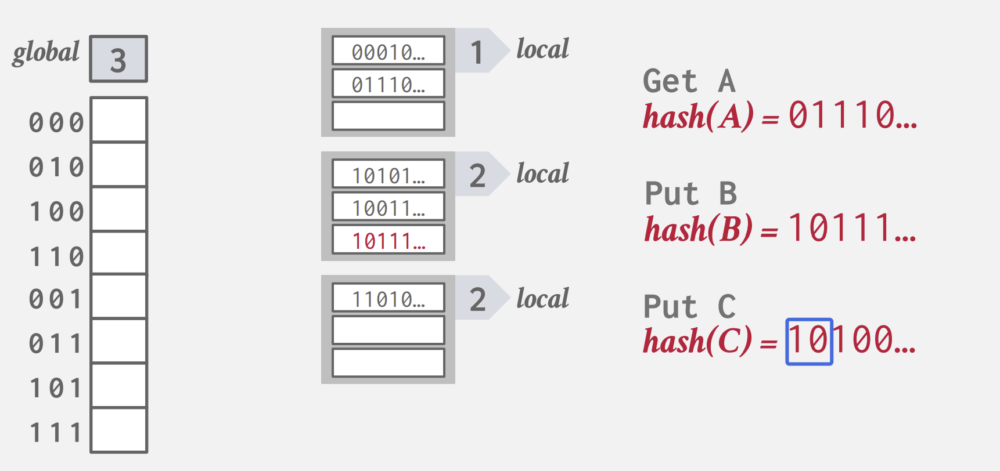

## 前言

我曾在 [HashMap源码分析](../java/SourceCode/HashMap.md) 中分析过 `JAVA` 中哈希表的实现，`HashMap` 作为 `JDK` 的源码，其通用性自然不必多说，我曾一度认为 `JDK` 的方案非常完美，并且自己也用 C 实现过`JDK` 的哈希表。在我看来，`JDK` 的 `HashMap` 方案有以下优点：

1.   同一个桶中，对于较长的链表，将其组织成红黑树。从数据结构的角度考虑，这是一个非常棒的设计，能够保证一定的查询速度，且红黑树在扩容时效率也比较高。

2.   具备并发扩展性。虽然 `JDK` 的 `HashMap` 不是线程安全的，但是我们可以对其方案进行扩展。像 `HashMap` 这种拉链法处理哈希冲突的方案，我们可以针对每个桶上锁，就可以做到并发访问哈希表了。事实上，`PostgreSQL` 的 `BufferManager` 中就维护了一个哈希表，用来存储 `BufferTag` （即页面编号）到 `Buffer_id` （本地缓冲的下标）的映射，`PostgreSQL` 对所有的桶进行分区，同一个分区的桶共用一把读写锁，这样，对 `BufferManager` 的访问请求就支持并发处理了。

     在实现这种并发访问的哈希表时，一个关键的参数就是分区的数量，分区的数量决定了锁的数量，在 `PostgreSQL` 的 `BufferManager` 中，分区的数量是 `128`，即存在 `128` 个分区的锁。

考虑到应用场景，作为内置的通用方案，`HashMap` 已经足够优秀，然而，许多针对不同的场景，许多方案可以做到比 `HashMap` 更高的效率或者更低的开销。例如：

-   `JDK` 的 `HashMap` 采用的是拉链法解决冲突，相同哈希值的键值会组成链表（当链表长度超过 $8$​ 时组织成红黑树），所有的拉链法都面临一个问题：存储上的不连续使得不能顺序遍历哈希表。而我们都知道， CPU 和操作系统针对顺序访问是有优化的，所以在某些场景下，顺序访问的哈希表可以做到更快。

    例如，随机访问的数据在写入到文件，或者读取到内存中时，序列化的时间比顺序访问要慢

-   `HashMap` 实质是一种动态哈希表，即哈希表的大小会动态变化。在某些场景下，整个哈希表的大小都不会超过一个固定值，这种场景下哈希表的大小是限定的，存在更高效的实现。

-   `HashMap` 中扩容是两倍扩容，这种扩容会一次性申请较大的内存空间。有些时候我们不希望占用空间增长这么多，而是进行线性的增长，后面会介绍一种线性扩容的方案。

再次强调，选用哪种哈希方案应该根据具体的应用场景而定，无论是 `JDK` 的 `HashMap` ，还是 `C++` 的 `unordered_map` ，作为一种通用方案（在内存中、动态大小扩容），是没有问题的。而一旦涉及到数据库内核的不同场景，应该采取不同的哈希方案，这就是 Trade-off 的过程了。

下面笔者基于 CMU-15445 Fall 2023 总结常用的一些哈希表设计方案。

## 哈希函数

哈希表的哈希函数并不需要密码学中的哈希函数特性（混淆、扩散）等，只需要能较快的算出哈希值，并且碰撞率尽可能低即可。

[rurban/smhasher: Hash function quality and speed tests (github.com)](https://github.com/rurban/smhasher) 这个仓库总结了许多哈希函数的性能与碰撞率的表现，总的来说，目前看来，常用的哈希函数选择有：

-   [CRC-64](https://create.stephan-brumme.com/crc32/) (1975) 常用于网络中的错误检测。
-   [MurmurHash](https://github.com/aappleby/smhasher) (2008) 一种快速、通用的哈希函数。
-   [Google CityHash](https://github.com/google/cityhash) (2011) 针对 $64$ 字节以内的数据进行快速哈希。
-   [Facebook XXHash](https://xxhash.com/) (2012) 基于 `zstd` 设计的哈希函数。
-   [Google FarmHash](https://github.com/google/farmhash) (2014) `CityHash` 的新版本，具有更低的碰撞率。

综合来说，最好的应该是 [Facebook XXHash](https://xxhash.com/)，应该优先选用。

## 静态哈希

哈希表可分为静态与动态的。像之前提到的 `JDK` 的 `HashMap` 就是一种动态的，在插入一个新元素时，`New` 一个新节点，然后插入到桶中。

静态哈希表在创建时就知道表中最多会出现多少数据，一次性申请出一个段连续的数组，所有的数据都存放在数组中。

当然，在必要的情况下，静态哈希表同样支持扩容/缩容的机制，但这种情况不会出现太多次（否则，应该选用动态哈希方案）。

### 线性探测

指的是发生哈希冲突时，线性的探测下一个位置，直到找到目标键，或找到空位置。

1.   插入：如下图所示，在插入 $C$ 时，$C$ 原本的位置被 $A$ 占据，则开始探测下一个位置，在第一个空位置将 $C$ 插入。

     <figure markdown>
     { width="800" }
     </figure>

2.   查找：查找时，从哈希的位置开始线性查找，直到找到目标键（查找成功），或者找到第一个空位置（查找失败）。

3.   删除：如下图所示，删除 $C$​ 时，首先查找出 $C$ 的位置，将这个位置标记为删除。

     <figure markdown>
     { width="800" }
     </figure>

     删除标记不会终止查找（只有目标键或者空标记才会终止查找），如下图所示，查找 $D$ 时，首先哈希到 $C$ 删除前的位置（已被标记为删除），继续线性探测找到 $D$ 的位置。

     <figure markdown>
     { width="800" }
     </figure>

	可以在删除标记的位置上插入元素，如下图所示，$G$ 经过哈希后插入到 $C$ 删除前的同一个位置。

     <figure markdown>
     { width="800" }
     </figure>

4.   回收删除标记与重新哈希：由于删除标记不会终止查找结果，过多的删除标记会降低查找的效率，因此，在必要的时候可以回收所有的删除标记，并对表中所有的键重新哈希。

5.   扩容：当表中元素达到阈值，此时需要对数组扩容，通常采用 $2$​ 倍扩容的方式，扩容后对表中所有的键重新哈希。

6.   重复键的存储：可以用链表存储相同的键；也可以直接在表中允许相同的键的存在（这种方式在查找时就必须找到空位置才终止）。大多数系统采用的是后者。

     <figure markdown>
     { width="800" }
     </figure>

7.   优化，针对线性探测法，有几种不同的优化。
     -   维护多个哈希表，针对不同的类型、大小进行分区。例如针对字符串的哈希，我们可以对不同的字符串长度进行分区。
     -   使用 `bitset` 或类似的实现来表示某一位是否为 空/被删除
     -   为每个位置标记版本号（其实就是一种懒删除的方式）

**小结**：虽然对哈希冲突的处理简单粗暴，但线性探测机充分利用了内存的空间局部性，能够保证均摊查找时间复杂度为 $O(1)$，大多数 DBMS 都采用了线性探测机制来构建哈希索引。

### 布谷鸟哈希

英文为 **Cuckoo hashing**，其中 Cuckoo 意为布谷鸟，布谷鸟具有两种习性：

1.  布谷鸟妈妈从不筑巢，它将自己的鸟蛋生在其他鸟类的巢穴里，要别的鸟给它孵蛋。
2.  **新出生的布谷鸟会本能地将巢穴里的其他蛋踢开（kick out ）**，**推出鸟巢**，以确保自己在鸟巢里可以独享宠爱。

该哈希方案最早由 CMU 提出, 源码仓库：[efficient/libcuckoo: A high-performance, concurrent hash table (github.com)](https://github.com/efficient/libcuckoo),仓库中也有论文。

在布谷鸟哈希中，有多个哈希函数。下面以两个哈希函数的情况为例：

1.   插入：如下图所示，$A$ 具有两个插入位置，此时两个位置都没有元素，随便选择一个都可以。

     <figure markdown>
     { width="800" }
     </figure>

     <figure markdown>
     { width="800" }
     </figure>

	现在插入 $B$，由于 $B$ 的哈希值其中一个已经有元素了，此时应该插入到空的位置中。

     <figure markdown>
     { width="800" }
     </figure>

	现在插入 $C$，由于 $C$ 的两个位置都有元素，根据布谷鸟的规则，$C$ 会随机踢掉其中一个元素，假设 $C$ 踢掉 $B$，如下图所示

     <figure markdown>
     { width="800" }
     </figure>
    
     <figure markdown>
     { width="800" }
     </figure>

	此时 $B$ 需要重新放置，假设 $B$ 踢掉了 $A$，$A$ 再重新放置，最终结果如下图所示

     <figure markdown>
     { width="800" }
     </figure>
    
     <figure markdown>
     { width="800" }
     </figure>

2.   如果出现循环替换的情况（或者替换的次数达到一定阈值），则需要对表进行两倍扩容，然后重新哈希。

**小结**：可以看出布谷鸟哈希的查找复杂度是非常稳定的，只需要进行若干次哈希就一定能找到目标键。而在循环替换时

## 动态哈希

动态哈希表在需要时申请所需的空间。下面介绍三种常用的动态哈希方案。

### 拉链法

将哈希值相同的键值对存放在一个链表中，如下图所示:

<figure markdown>
{ width="800" }
</figure>

本文一开始所提到的 `JDK` 的 `HashMap` 就是采用了这种方案，有关拉链法的更多细节,可以参照我的另一篇博客 [HashMap源码分析](../java/SourceCode/HashMap.md) 。

`HashMap` 中针对链表较长的情况会将数据组织成链表，保证查询速度。下面讲讲使用布隆过滤器对哈希表进行优化，对于布隆过滤器的原理可以看看这个视频 [程序员都必须会的技术，面试必备【布隆过滤器详解】，Redis缓存穿透解决方案](https://www.bilibili.com/video/BV1zK4y1h7pA/?spm_id_from=333.337.search-card.all.click)

布隆过滤器的初始化需要两个参数：存储的元素个数以及误差率，这两个参数通过一个公式计算出布隆计算器需要多少位以及多少个哈希函数。只需要利用布隆过滤器的性质，在查询哈希表前查一次布隆过滤器即可。

### 线性哈希

Postgres 采用的是线性哈希的方案，这个方案是对拉链法做出的改进。

试想一下，在并发场景下，拉链法会在整个哈希表达到扩容阈值时锁定整个表，然后对表中的每个桶重新哈希，移动键值对，所以扩容的开销是很大的。而线性哈希的理念是将全表的扩容均摊成若干个桶的扩容，也就是每一次扩容都是线性的，这样每一次桶扩容只会影响到当前的桶，而不是像拉链法中锁定整个表，进行全局的搬迁。

在线性哈希中，我们规定一个桶最多容纳 $C$ 个键值对（$C$ 取决于页面大小和键值对类型），同时，维护一个 **Split Pointer**，如下图所示，当前 Split Pointer 指向 $0$ 号桶。

<figure markdown>
{ width="800" }
</figure>

当某个桶溢出时，对 Split Pointer 所指的桶进行扩容，例如，在上图中 $n = 4$，则对于 $0$ 号桶来说，扩容后的镜像桶是 $4$ 号桶，于是我们创建一个 $4$ 号桶，对 $0$ 号桶重新哈希，将部分数据迁移到 $4$ 号桶（根据 $\text{key} \bmod 2n$ 的值是 $0$ 还是 $4$，决定元素应该留在 $0$ 号桶还是 搬到 $4$ 号桶），扩容后的结果如下图所示：

<figure markdown>
{ width="800" }
</figure>

在扩容后，Split Pointer 移动，指向 $1$ 号桶的位置。

可以看到，线性哈希在一次扩容中，仍然会有一些桶是溢出的状态，上面的例子中，发生溢出的桶是 $1$，而扩容的桶却是 $4$。但是，由于 Split Pointer 迟早会移动到实际扩容的桶中，所以最终实际溢出的桶也会扩容。为此，我们需要允许某些桶溢出（即准备更多的页面，让桶之间形成一个链表，简称“溢出桶”）。

### 可扩展哈希

拉链法在扩容时需要进行重新哈希，每个桶中的元素都会分割。然而我们注意到，在拉链法扩容时，实际上只有个别的桶的元素较多，而其余的桶元素数量并不大，却依然被分割。

从桶分割的角度考虑，当一个桶的元素过多时，我们应该针对这个桶单独分割，保持其他桶的元素不变。可扩展哈希就是这样一种哈希方式。首先，可扩展哈希的哈希值计算并不是取模运算，而是取出哈希值的前几位作为键。我们维护一个变量 $\text{global}$，例如下图就是 $\text{global}$ 为 $2$ 的例子。

<figure markdown>
{ width="800" }
</figure>

上图中，我们取出前 $2$ 位作为键，每个键都指向一个桶。

可以注意到，可扩展哈希允许多个下标的桶指针指向同一个桶，例如 $00$ 和 $01$ 就指向第一个桶，此时桶中既存放着哈希前缀为 $00$，以及哈希前缀为 $01$ 的键值对。

每个桶中也维护着一个变量 $\text{local}$，用来表示桶的容量为 $2^{\text{local}}$  ，例如上图中第一个桶的 $\text{local}$ 为 $1$，表示这个桶的容量是 $2^1$。

1.   查询：根据哈希值前 $\text{global}$ 位获取桶指针，然后在对应的桶中查找即可，如下图所示，前 $2$ 位是 $01$，则查找第一个桶。

<figure markdown>
{ width="800" }
</figure>

1.   插入元素与桶分割：当桶的容量达到 $2^\text{local}$ 时，需要对桶进行扩容与分割。扩容有两种情况：

     -   如果 $\text{local} < \text{global}$，表明当前桶同时被多个指针所指，那么扩容时，增大 $\text{local}$ 的值，也就是 $\text{local} \leftarrow \text{local} + 1$，扩展 $\text{local}$ 会导致指针的分裂，如下图所示，假设我们对上图中 `10` 前缀的桶（第二个桶）插入元素，导致扩容：

     <figure markdown>
     { width="800" }
     </figure>

     <figure markdown>
     { width="800" }
     </figure>
     如上图所示，经过扩容后，第二个桶（后缀为 `10` ）分裂成了 `100` 和 `101` 桶。桶分裂的同时，对应的元素也要进行分裂。如此	进行下去，直到新桶有足够的空间插入新的键或 $\text{local} = \text{global}$

     -   如果 $\text{local} = \text{global}$，那么我们需要先增大 $\text{global}$，让 $\text{global} \leftarrow \text{global} + 1$，这会导致 $\text{global}$ 数组的扩容两倍，指针数量翻倍，新增加的指针指向原先 $\text{global}-1$ 的桶。然后，对于插入时发生溢出的桶，执行一遍 $\text{local} < \text{global}$ 的流程即可。

2.   删除元素与桶合并：当我们删除元素后，有些桶的元素数量会较少，所以可以进行合并。合并的两个桶必须具有共同的 $\text{local}$，例如 `11 0` 和 `11 1`，可以合并成 `11`。

#### 为什么叫可扩展哈希？

可扩展哈希可以扩展成多级结构，如下图所示，我们可以扩展成 $3$ 级结构。其中 $\text{header}$ 记录了一个哈希值 **前缀** 的指针，而 $\text{directory}$ 相当于刚刚提到的 $\text{global}$ 表，$\text{bucket}$ 就是 $\text{local}$ 表。

<figure markdown>
{ width="800" }
</figure>

在这种扩展下，当我们查询某个键值对时，首先在 $\text{header}$ 表中根据哈希值 **前缀** 查出 $\text{directory}$ 表，然后在 $\text{directory}$ 表中根据哈希值 **后缀** 查找出对应的桶。

这种分级结构增大了可存储的键值范围，同时允许我们持有更多细粒度的锁，从而提高并发度。