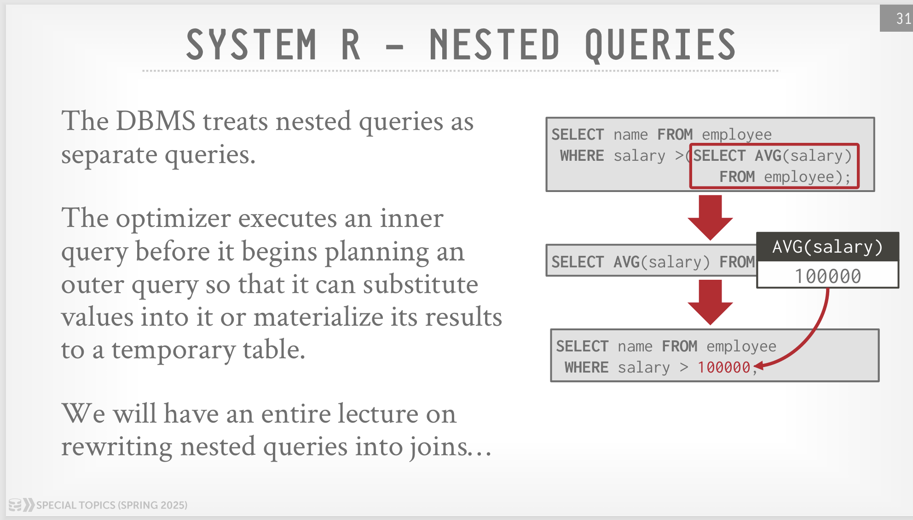

IBM System R 优化器的总体执行步骤是：

1.   执行所有的 RBO
2.   为每个单表选出最佳的 Access Path（Seq Scan 或者 Index Scan）。
3.   采用左深树动态规划确定 join 顺序

因为后两步都是 CBO，所以这篇博客主要讲讲 System R 的代价模型。

## 查询结果规模估算
System R 使用 **selectivity factor** 表示一个谓词命中的概率，下面用 $\text{F}$ 指代  **selectivity factor**。$\text{F}$ 是一个 $[0,1]$ 的值，如果 $\text{F}(\text{cond}_i)$ 的值越小，表示 $\text{cond}_i$ 满足的概率越小（过滤能力越强）。

假设一个表 $T$ 有 $\text{NCARD}(T)$ 个元组，则 $\text{NCARD}(T) \times \text{F}(\text{cond}_i)$ 表示应用谓词 $\text{cond}_i$ 之后筛选出的结果大小。

在谓词下推之后，每个表的上方都是是一种主合取范式的形式 $\text{cond}_1 \land \text{cond}_2 \land \text{cond}_3 \ ...$，应用所有谓词之后的结果大小就是 $\text{NCARD}(T) \times \prod \text{F}(\text{cond}_i)$

System R 的统计信息包括每个表的元组数量、每个索引不同 key 的数量、每个索引最大的 key 和最小的 key 等。为了对每个谓词模式计算出恰当的 $\text{F}$ 值，System R 还有一个重要的假设：

>   This assumes an even distribution of tuples among the index key values.
>
>   假设所有索引中的 key 是均匀分布的。

$F$ 值的计算方式如下：

1. column = value

    -   如果 `column` 有可用的索引， $\text{F} = \frac{1}{\text{ICARD(column index)}}$，其中 $\text{ICARD(I)}$ 表示索引 $\text{I}$ 中不同 key 的个数

    -   否则，$\text{F} = \frac{1}{10}$

2. column1 = column2

    -   如果 `column1` 和 `column2` 都有可用的索引， $\text{F} = \frac{1}{\max(\text{ICARD(column1 index)},\text{ICARD(column2 index)})}$

    -   如果只有 `column-i` 有可用的索引， $\text{F} = \frac{1}{\text{ICARD(column-i index)}}$

    -   否则，$\text{F} = \frac{1}{10}$

3. column > value

    -   如果`column` 有可用的索引、 且 `column` 是算术式、且 `value` 的值固定， $\text{F} = \frac{\text{max key} - \text{value}}{\text{max key} - \text{min key}}$

    -   否则，$\text{F} = \frac{1}{3}$

    这里第二种情况包括：`value` 值不固定、`column` 没有可用的索引、`column` 不是算术式（例如字符串，无法相减）等。取 $\text{F} = \frac{1}{3}$ 这个值是因为假定了用户的过滤条件能过滤掉至少一半的元组，但这个值又会比 `column = value` 的 $\frac{1}{10}$ 大一些。

4. column BETWEEN value1 AND value2

    -   如果`column` 有可用的索引、 且 `column` 是算术式、且 `value1` 和 `value2` 的值固定， $\text{F} = \frac{\text{value2} - \text{value1}}{\text{max key} - \text{min key}}$
    -   否则，$\text{F} = \frac{1}{4}$
    
    选取 $\frac{1}{4}$ 要比 `column > value` 的 $\frac{1}{3}$ 小一些。

5. column IN (list)
    -   $\text{F} = \text{len(list)} \times \text{F}(\text{column = value})$

6. columnA IN subquery
    -   $\text{F} = \frac{\text{子查询的估计规模}}{\text{子查询 FROM 中所有的表的元组的乘积}}$

7. (pred1) OR (pred2)
    -   $\text{F} = \text{F(pred1)} + \text{F(pred2)} - \text{F(pred1)} \times \text{F(pred2)}$

8. (pred1) AND (pred2)
    -   $\text{F} = \text{F(pred1)} \times \text{F(pred2)}$

9. NOT pred
    -   $\text{F} = 1 - \text{F(pred)}$

## Access Path 成本估算

对于一个单表，可以选择用 Index Scan 或者 Seq Scan，每种方式称为一条 Access Path，Access Path 的成本估算的通用公式为：
$$
\text{COST} = \text{PAGE FETCHES} + W \times (\text{RSI CALLS})
$$
其中，$\text{PAGE FETCHES}$ 表示 IO 了多少个页面（估计值），$\text{RSI CALLS}$（也即 $\text{RSICARD}$ ） 表示应用了所有可搜索（sargable，原文有详细的定义）的谓词之后得到的元组数量（估计值），$W$ 是一个系数，用来量化磁盘 IO 和计算的开销倍数。

总的来说，这个公式就是综合了磁盘 IO 的成本和 CPU 计算的成本。

选用不同的索引或全表扫描，带来的成本也是不同的，但本质都是上面公式的特例，具体如下：

1.   如果有一个等值谓词，且该列有唯一键索引，则 $\text{COST} = 1 + 1 + W$

     这里假定 B+ 树的非叶子节点都在内存池中，所以最多 IO 一个叶子节点索引页、一个数据页，以及一次 RSI CALL。

2.   如果有聚集索引 $\text{I}$ 命中了一个或多个谓词，则 $\text{COST} = \text{F(preds)} \times (\text{NINDS(I)} + \text{TCARD}) + W \times \text{RSICAR}$，其中 $\text{NINDS(I)}$ 表示索引 $\text{I}$ 的页面数量，$\text{TCARD}$ 表示这个表的页面数量。

     这个公式直接用 $\text{F(preds)}$ （这里的 $\text{preds}$ 指的是命中索引的谓词，而不是所有可搜索谓词）作为页面的比例。

3.   如果有辅助索引 $\text{I}$ 命中了一个或多个谓词，分两种情况：

     -   如果内存池装得下足够多的页面，则 $\text{COST} = \text{F(preds)} \times (\text{NINDS(I)} + \text{TCARD}) + W \times \text{RSICAR}$，和聚集索引一致。

     -   否则，$\text{COST} = \text{F(preds)} \times (\text{NINDS(I)} + \text{NCARD}) + W \times \text{RSICAR}$，其中 $\text{NCARD}$ 表示这个表的元组数量。

         这里因为内存池装不下，且是辅助索引，最坏的情况就是每读一个元组都要把数据页 IO 进来，所以最坏就是有 $\text{NCARD}$ 次页面 IO。

4.   如果有聚集索引 $\text{I}$ 没有命中任何谓词，则 $\text{COST} = (\text{NINDS(I)} + \text{TCARD}) + W \times \text{RSICAR}$
5.   如果有辅助索引 $\text{I}$ 没有命中任何谓词，分两种情况：
     -   如果内存池装得下足够多的页面，则 $\text{COST} = (\text{NINDS(I)} + \text{TCARD}) + W \times \text{RSICAR}$，和聚集索引一致。
     -   否则，$\text{COST} = (\text{NINDS(I)} + \text{NCARD}) + W \times \text{RSICAR}$

6.   全表扫描，$\text{COST} = \frac{\text{TCARD}}{P} + W \times \text{RSICAR}$，这里 $P$ 表示这个表在一个 Segment 的非空页面比例，所以把这个 $\frac{\text{TCARD}}{P}$ 的含义就是表所在的 Segment 的非空页面数量。（受当时计算机硬件的限制，System R 会把很多个表放在同一个 Segment，所以全表扫描实际是扫的一整个 Segment）

## 有趣顺序

原文是 **interesting order**，指的是对哪些列排序感兴趣，有三种来源：

1.   Order By 中的列
2.   Group By 中的列
3.   出现在 Join 条件中的列

一个表并不是只考虑一种 Access Path，而是考虑所有的有趣顺序，这是因为如果一个表以某个有趣顺序扫描出来的话，就可以免去后续的排序开销。（当时没有哈希的 Group By 和 Hash Join，所以对于后两种，也被视为有趣的顺序）。

每个表需要考虑所有需要用到的有趣顺序，估算出对应的成本。对于单表来说，获得一种有趣的顺序有两种办法：通过对应的索引扫描，或者通过其他扫描方式（包括全表扫描），再加上排序的成本。

## 多表 Join 成本估算

经典的自下而上的动态规划，由于还需考虑后续的有趣顺序，所以实现上，应该是用 $dp[s][i]$ 表示状态为 $s$ 的表已经 Join，且有趣的顺序为 $i$ 的最低成本。

在 dp 的时候可以应用以下规则减少搜索空间：

1.   尽量避免会产生笛卡尔积的 Join。
2.   只考虑左深树以减少时间复杂度。（受限于当时的硬件，如果不用左深树，一方面时间复杂度高，另一方面 Join 之后的中间表会变的很大，不用左深树就意味着会有两个以上的大表，内存池可能装不下，如果把大表刷回磁盘就又会有开销）

System R 发表时还没有哈希 join，join 的方式只有两种：NLJ 和 Sort Merge Join：

### NLJ 成本估算

考虑外表和内表，设外表满足所有可搜索谓词的元组数量为 $N$，则 $N = \text{外表所有关系的元组数量的乘积} \times \text{外表所有可搜索谓词的 F 值}$

可以理解为，$N$ 就是外表预计产生的元组数量。NLJ 的成本公式为：
$$
C_\text{NLJ(pathl,path2)}= C_\text{outer}(\text{path1}) + N * C_\text{inner}(\text{path2})
$$
这个公式比较简单，外层扫出 $N$ 条，然后扫内层即可。

### Merge Join 成本估算

Merge Join 可以获得有趣的顺序，但 Merge Join 的前提是内表和外表都是有序的。和前面所说的一样，要想获得有序的表，要么在 dp 的时候直接使用这个有趣的顺序，要么就在其他顺序中选一个排序之后成本最低的参与计算。成本公式为：
$$
C_\text{Merge(pathl,path2)}= C_\text{outer}(\text{path1}) + \text{InnerPage} + N \times W \times \text{RSICAR}
$$
上述公式忽略了排序的成本。（这个公式和原文是等价的）

## 总结

作为最经典的优化器论文，System R 提供了一个简单、切实可行的优化器架构。许多现代优化器都能看到 System R 的影子。

其优点有：

1.   不仅涵盖了 RBO，而且有 CBO，能搜索出相对较好的连接方式。
2.   介绍了一种简单可行的代价模型。
3.   能够优化多表 join 场景，对于嵌套子查询也能优化一部分。

其缺点有：

1.   代价模型认为所有 key 是均匀分布的，这不符合实际情况，需要更加复杂的统计信息、代价模型。

2.   在处理嵌套子查询的时候，System R 实际是对多个子查询进行分解，也就是先物化内层的子查询，然后才会开始上层的优化（成本估算）。这种方式有时候效果并不好（因为会多出一些 IO 的成本）

     详细如图（图片来自 cmu 15-799）

     
     
     
     System R 的执行器是会物化中间表，而不是像 Volcano 一样一次只返回一条数据，就会有这样的问题
