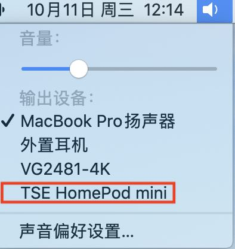
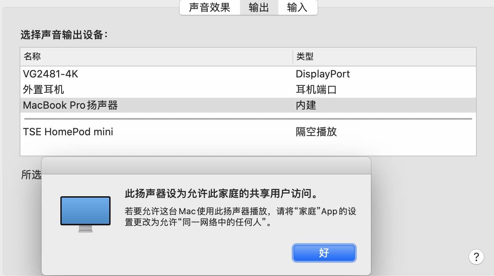

## 231011
昨晚（大概23点）在切换电脑的音频输出时意外发现了一个新的设备:

<figure markdown>
  { width="300" }
  <figcaption>这是谁的设备？？</figcaption>
</figure>
我舍友没有HomePod，所以推断这是隔壁某个寝室的。又因为北邮的WIFI是AC+AP，HomePod（苹果自家的音响）支持同一个网络下隔空播放，所以出现在了我的电脑中。

于是我决定皮一下......

是的，我连上了这个HomePod，并且特意给他播放了一曲《烟distance》。

连上之后发现声音不大（毕竟是在隔壁），于是我把音量加到了最大。

然后我隐隐约约听到了《烟distance》的声音（还有隔壁传来的“卧槽”），满意的关掉了音乐。（大概播放了10s，怕被打）。

睡前和舍友讲了这件事之后我还是很难崩，躺在床上笑出声......

今天中午发现这个HomePod把局域网连接的权限改掉了😂😂😂
<figure markdown>
  { width="300" }
  <figcaption></figcaption>
</figure>

---

## 231013
最近每隔半个月会失眠一次，睡的好难受......

中午上课回来应该只睡了40分钟。

方班（一门课）好烦啊，今天明明可以6点下课的，为什么要拖到6点30？

食堂没菜了，打算骑车去吃饭。结果今天周五，校内一辆美团都没了！硬是走到物美了。。。

麦麦的新品麻酱芝士还行，但是本质还是板烧加了点酱，吃多了肯定是会腻的。（感谢夫夫的m卡）

美团的车筐有一句话“请不要在车筐里坐人”。 emmmm...

为什么京东7点40就关门了？（其他都是8点）

回到宿舍被老谭硬拉着去操场锻炼了一会...腿更酸了！

早点休息！

---

## 231024
看了一下日期，今天竟然是程序员节！？

中午睡觉的时候做了一个很神奇的梦，我梦到我在做英语阅读（好像是高中，又好像是大学），神奇的是有一部分英文自动变成了中文的翻译，就像我平常使用浏览器的翻译一样。然后，在梦中我尝试将翻译关掉，一开始的时候关闭成功，原文又变成了英文，后面怎么关也关不掉，全都变成了中文...

不过...为什么我想关掉翻译呢？可能是平常我在翻译完之后习惯切回原文对照着看看？