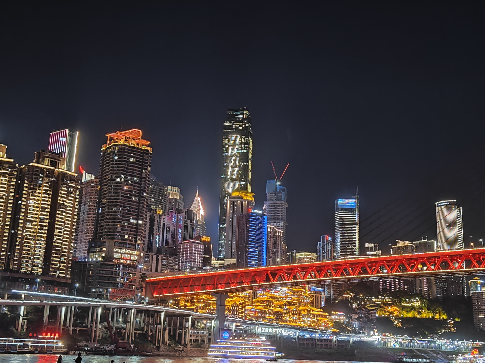
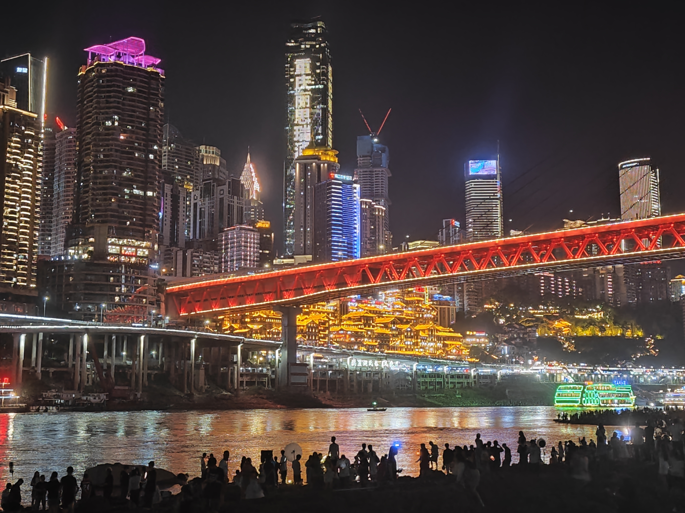

# Some Photes of Hongya Cave

The photos I took in 2023.06.{width:"300%"}

{width:"300%"}

Here are some photos I found on the Internet,  you can see Hongya Cave from different perspectives Through them.

